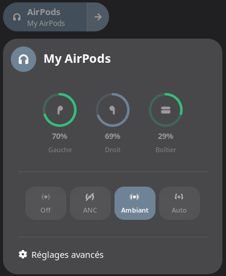

# EarPort

AirPods integration for GNOME Shell on Linux. This project provides full support for Apple AirPods features including battery status, noise control modes, and automatic media pause on ear detection.




## Features

- **Battery monitoring** - Real-time battery levels for left pod, right pod, and charging case
- **Noise control modes** - Switch between Off, ANC, Transparency, and Adaptive modes
- **Long press customization** - Configure which noise control modes cycle on stem long press
- **Ear detection** - Automatic media pause/resume when removing/inserting AirPods
- **Quick Settings integration** - Native GNOME Shell Quick Settings panel
- **Quick mode switching** - Click the Quick Settings tile or use a configurable keyboard shortcut (default `Super+Shift+N`) to cycle noise control modes, with OSD feedback
- **Notifications** - Connection/disconnection and low battery notifications
- **Model detection** - Automatic detection of AirPods model with feature adaptation
- **Per-device settings** - Settings are saved individually for each paired AirPods
- **Translations** - Fully translatable (French included)

### Supported Models

| Model | Battery | ANC | Transparency | Adaptive |
|-------|---------|-----|--------------|----------|
| AirPods 1st/2nd Gen | ✓ | - | - | - |
| AirPods 3rd Gen | ✓ | - | - | - |
| AirPods 4th Gen | ✓ | - | - | - |
| AirPods 4th Gen (ANC) | ✓ | ✓ | ✓ | ✓ |
| AirPods Pro | ✓ | ✓ | ✓ | - |
| AirPods Pro 2 | ✓ | ✓ | ✓ | ✓ |
| AirPods Pro 3 | ✓ | ✓ | ✓ | ✓ |
| AirPods Max | ✓ | ✓ | ✓ | - |

## Architecture

The project consists of two components:

1. **earport-daemon** - A C daemon that communicates with AirPods via Bluetooth L2CAP and exposes state via D-Bus
2. **GNOME Shell Extension** - A JavaScript extension that displays AirPods status in Quick Settings

## Requirements

### Build Dependencies

```bash
# Debian/Ubuntu
sudo apt install meson ninja-build libglib2.0-dev libbluetooth-dev

# Fedora
sudo dnf install meson ninja-build glib2-devel bluez-libs-devel

# Arch Linux
sudo pacman -S meson ninja glib2 bluez-libs
```

### Runtime Dependencies

- GNOME Shell 46 or later
- BlueZ (Bluetooth stack)
- AirPods paired via Bluetooth settings

## Installation

### Quick Install (Recommended)

```bash
./install.sh
```

This will build and install the daemon, enable the systemd service, and install the GNOME Shell extension.

### Manual Installation

#### 1. Build and Install the Daemon

```bash
cd daemon
meson setup build
ninja -C build
sudo ninja -C build install
```

#### 2. Enable the Systemd User Service

```bash
systemctl --user enable --now earport-daemon.service
```

#### 3. Install the GNOME Shell Extension

```bash
# Copy extension to GNOME Shell extensions directory
cp -r extension ~/.local/share/gnome-shell/extensions/earport@anoryth.github.io

# Enable the extension
gnome-extensions enable earport@anoryth.github.io
```

#### 4. Restart GNOME Shell

- **X11**: Press `Alt+F2`, type `r`, press Enter
- **Wayland**: Log out and log back in

## Usage

1. Pair your AirPods via GNOME Bluetooth settings
2. Connect your AirPods
3. The EarPort indicator will appear in the Quick Settings panel
4. Click to expand and see battery levels and noise control options

### Ear Detection & Media Control

By default, media will automatically pause when you remove one or both AirPods from your ears, and resume when you put them back in.

## Uninstallation

### Quick Uninstall

```bash
./install.sh --uninstall
```

### Manual Uninstallation

```bash
# Stop and disable the daemon
systemctl --user disable --now earport-daemon.service

# Remove the daemon
sudo ninja -C daemon/build uninstall

# Remove the extension
rm -rf ~/.local/share/gnome-shell/extensions/earport@anoryth.github.io

# Restart GNOME Shell
```

## Troubleshooting

### Daemon not starting

Check the daemon logs:
```bash
journalctl --user -u earport-daemon.service -f
```

### Extension not appearing

1. Ensure the extension is enabled:
   ```bash
   gnome-extensions list | grep earport
   ```

2. Check for extension errors:
   ```bash
   journalctl -f /usr/bin/gnome-shell
   ```

### AirPods not detected

1. Ensure AirPods are paired and connected via Bluetooth
2. Check if the daemon detects the device:
   ```bash
   journalctl --user -u earport-daemon.service | grep -i airpods
   ```

## Development

### Testing the Daemon

```bash
# Run daemon in foreground with debug output
G_MESSAGES_DEBUG=all ./daemon/build/earport-daemon
```

### D-Bus Interface

The daemon exposes its interface at `io.github.anoryth.EarPort` on the session bus:

```bash
# Get battery levels
gdbus call --session --dest io.github.anoryth.EarPort \
  --object-path /io/github/anoryth/EarPort \
  --method org.freedesktop.DBus.Properties.Get \
  io.github.anoryth.EarPort1 BatteryLeft

# Set noise control mode
gdbus call --session --dest io.github.anoryth.EarPort \
  --object-path /io/github/anoryth/EarPort \
  --method io.github.anoryth.EarPort1.SetNoiseControlMode "anc"
```

## Credits

This project is based on the protocol reverse-engineering work from the [LibrePods](https://github.com/kavishdevar/librepods) project by Kavish Devar. EarPort is an independent project and is not affiliated with LibrePods.

AirPods is a trademark of Apple Inc. This project is not affiliated with or endorsed by Apple.

## License

This project is licensed under the GNU General Public License v3.0 - see the [LICENSE](LICENSE) file for details.