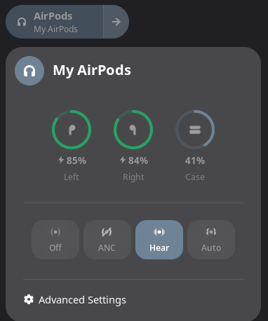

# EarPort

AirPods integration for GNOME Shell on Linux. This project provides full support for Apple AirPods features including battery status, noise control modes, and automatic media pause on ear detection.




## Features

- **Battery monitoring** - Real-time battery levels for left pod, right pod, and charging case
- **Battery in GNOME** - The AirPods' battery also shows in Settings › Power and wherever GNOME lists Bluetooth device batteries
- **Battery while on another device** - When your AirPods are used by your iPhone or sit idle nearby, the menu still shows their battery, with their name
- **Case battery with the AirPods out** - On models whose case reports it (see below), the case's level and charging state stay up to date while you wear the AirPods
- **Noise control modes** - Switch between Off, ANC, Transparency, and Adaptive modes
- **Long press customization** - Configure which noise control modes cycle on stem long press
- **AirPods settings** - Change the settings stored on the AirPods (noise cancellation with one AirPod, personalized volume, press speed, press and hold duration, volume swipe); only the settings your model reports are shown
- **Conversation Awareness** - Lowers the volume while you speak, as on an iPhone, to the level you choose, with a smooth fade
- **Quiet conversations** - Notification banners and their sounds wait until you stop speaking (can be turned off)
- **Automatic connection** (optional) - Connects the AirPods when you put them in or start playing on the computer, but never takes them from another device that is playing or in a call
- **Switch with your Apple devices** (optional, experimental) - The AirPods move between the computer and your iPhone, iPad or Mac on their own, as between Apple devices, and stay connected to both
- **Remaining listening time** - Estimated from how fast your own AirPods discharge, learned over your listening sessions
- **Ear detection** - Automatic media pause/resume when removing/inserting AirPods
- **Pause when falling asleep** - When your AirPods notice you fell asleep, playback pauses after a 10-minute grace period, as on an iPhone, unless you use the computer meanwhile; players that allow it go back to where you dozed off (on models offering the setting, turned on in the AirPods settings)
- **Quick Settings integration** - Native GNOME Shell Quick Settings panel
- **Quick mode switching** - Click the Quick Settings tile or use a configurable keyboard shortcut (default `Super+Shift+N`) to cycle noise control modes, with OSD feedback
- **Notifications** - Connection/disconnection and low battery notifications
- **Model detection** - Automatic detection of AirPods model with feature adaptation
- **Per-device settings** - Settings are saved individually for each paired AirPods
- **Accessibility** - Battery levels and the active mode are read by screen readers, full keyboard navigation, follows the Large Text setting
- **Translations** - French, Ukrainian, German, Spanish, Italian, Brazilian Portuguese and Dutch (the last five are first drafts: reviews welcome)

### Supported Models

| Model | Battery | ANC | Transparency | Adaptive | Case battery, AirPods out |
|-------|---------|-----|--------------|----------|---------------------------|
| AirPods 1st/2nd Gen | ✓ | - | - | - | - |
| AirPods 3rd Gen | ✓ | - | - | - | - |
| AirPods 4th Gen | ✓ | - | - | - | - |
| AirPods 4th Gen (ANC) | ✓ | ✓ | ✓ | ✓ | ✓ |
| AirPods 5 | ✓ | ✓ | ✓ | ✓ | - |
| AirPods 5 (Wireless Charging Case) | ✓ | ✓ | ✓ | ✓ | ✓ |
| AirPods Pro | ✓ | ✓ | ✓ | - | - |
| AirPods Pro 2 (Lightning and USB-C) | ✓ | ✓ | ✓ | ✓ | ✓ |
| AirPods Pro 3 | ✓ | ✓ | ✓ | ✓ | ✓ |
| AirPods Max | ✓ | ✓ | ✓ | - | - |
| AirPods Max 2 | ✓ | ✓ | ✓ | - | - |

The case battery with the AirPods out was tested on AirPods Pro 2 (USB-C); reports for the other models are welcome.

The battery while on another device and the case battery with the AirPods out
come from the AirPods' Bluetooth LE broadcasts: they work once the AirPods have
connected to this computer at least once, and need Bluetooth LE scanning (a few
seconds every half minute while the AirPods are away, about once a minute for
the case).

## Architecture

The project consists of two components:

1. **earport-daemon** - A C daemon that communicates with AirPods via Bluetooth L2CAP and exposes state via D-Bus
2. **GNOME Shell Extension** - A JavaScript extension that displays AirPods status in Quick Settings

## Requirements

- GNOME Shell 46 or later
- BlueZ (Bluetooth stack)
- AirPods paired via Bluetooth settings

## Installation

EarPort has two parts: the GNOME Shell extension, and a small service
(`earport-daemon`) that talks to the AirPods over Bluetooth. Both are needed.

### Quick Install (Recommended)

**1. The service**, prebuilt for x86_64 and ARM64: no compiler, no sudo, installed
in your home directory. Run the same command again to update it.

```bash
curl -fsSL https://github.com/Anoryth/earport/releases/latest/download/install-daemon.sh | bash
```

To remove it: `curl -fsSL https://github.com/Anoryth/earport/releases/latest/download/install-daemon.sh | bash -s -- --uninstall`

<details>
<summary>Prefer to check what you run? Same install, step by step</summary>

```bash
base=https://github.com/Anoryth/earport/releases/latest/download
curl -fsSLO "$base/install-daemon.sh"
curl -fsSLO "$base/earport-daemon-linux-$(uname -m).tar.gz"
curl -fsSLO "$base/SHA256SUMS"
sha256sum --check --ignore-missing SHA256SUMS
less install-daemon.sh   # read it
bash install-daemon.sh --from-file "earport-daemon-linux-$(uname -m).tar.gz"
```

</details>

**2. The extension**: download `earport@anoryth.github.io.shell-extension.zip` from the
[latest release](https://github.com/Anoryth/earport/releases/latest), then:

```bash
gnome-extensions install earport@anoryth.github.io.shell-extension.zip
```

Log out and back in (Wayland), then enable EarPort in the Extensions app.

### Build from Source

Build dependencies:

```bash
# Debian/Ubuntu
sudo apt install meson ninja-build libglib2.0-dev libbluetooth-dev

# Fedora
sudo dnf install meson ninja-build glib2-devel bluez-libs-devel

# Arch Linux
sudo pacman -S meson ninja glib2 bluez-libs
```

Then, as your regular user:

```bash
./install.sh
```

This builds the service and installs it for your user, exactly like the
quick install (in `~/.local`, no sudo), then installs the extension. If an
older version installed the service system-wide in `/usr/local`, it offers
to remove it (the only step asking for sudo).

#### Manual Steps

1. Build the service and install it for your user:

   ```bash
   meson setup daemon/build daemon --buildtype=release
   ninja -C daemon/build
   bash install-daemon.sh --from-file "$(tools/pack-daemon.sh daemon/build)"
   ```

2. Install the extension:

   ```bash
   cp -r extension ~/.local/share/gnome-shell/extensions/earport@anoryth.github.io
   glib-compile-schemas ~/.local/share/gnome-shell/extensions/earport@anoryth.github.io/schemas
   gnome-extensions enable earport@anoryth.github.io
   ```

3. Restart GNOME Shell: log out and back in (Wayland), or `Alt+F2`, `r` (X11)

## Usage

1. Pair your AirPods via GNOME Bluetooth settings
2. Connect your AirPods
3. The EarPort indicator will appear in the Quick Settings panel
4. Click to expand and see battery levels and noise control options

### Ear Detection & Media Control

By default, media will automatically pause when you remove one or both AirPods from your ears, and resume when you put them back in.

### Switching With Your Apple Devices (Experimental)

Turn on **Switch With Your Apple Devices** in the preferences. The computer then
presents itself as an Apple device to the AirPods, which reconnect briefly to
notice it. From then on, as between a Mac and an iPhone:

- the AirPods stay connected to the computer and to your iPhone (or iPad, or
  Mac) at the same time;
- they play from the one you start playing on: when another device takes them,
  playback pauses here, and resumes after a notification read aloud or a call;
- **Use on This Computer** in the menu brings them back at once;
- taking out one AirPod keeps the computer connected while it plays; if the
  other device was playing, the computer reconnects by itself in a few seconds,
  without notifications.

Limitations: tested with AirPods Pro 2 and an iPhone so far. With more than two
devices using them, the AirPods choose which ones they keep. The quiet
reconnection needs BlueZ 5.73 or later. While the option is on, other Apple
accessories nearby may also take the computer for an Apple device. Turning it
off stops EarPort's part (pausing, resuming, reconnecting), but the AirPods
remember the computer as an Apple device and may keep moving between it and
your other devices; removing them from the Bluetooth settings and pairing them
again should undo it.

### Battery Elsewhere

When the AirPods are not connected to the computer, the Quick Settings menu
still shows their battery if they are nearby, with "Other device" when your
iPhone (or another device) is using them. Inside a closed case, AirPods stay
silent: open the lid to refresh their levels.

## Uninstallation

### Quick Uninstall

```bash
./install.sh --uninstall
```

### Manual Uninstallation

```bash
# Stop and remove the service (settings in ~/.config/earport stay)
bash install-daemon.sh --uninstall

# Remove the extension
rm -rf ~/.local/share/gnome-shell/extensions/earport@anoryth.github.io

# Restart GNOME Shell
```

## Troubleshooting

### Daemon not starting

Check the daemon logs:
```bash
journalctl --user -u earport-daemon.service -f
```

### Extension not appearing

1. Ensure the extension is enabled:
   ```bash
   gnome-extensions list | grep earport
   ```

2. Check for extension errors:
   ```bash
   journalctl -f /usr/bin/gnome-shell
   ```

### AirPods not detected

1. Ensure AirPods are paired and connected via Bluetooth
2. Check if the daemon detects the device:
   ```bash
   journalctl --user -u earport-daemon.service | grep -i airpods
   ```

### Collecting debug logs

Raw AirPods packets are only logged in debug mode. To include them in the service logs (useful when reporting a bug):

```bash
systemctl --user edit earport-daemon.service
# Add the following lines, then save:
#   [Service]
#   Environment=G_MESSAGES_DEBUG=all
systemctl --user restart earport-daemon.service
```

Remove the override afterwards with `systemctl --user revert earport-daemon.service`.

## Development

### Testing the Daemon

```bash
# Run daemon in foreground with debug output
G_MESSAGES_DEBUG=all ./daemon/build/earport-daemon

# Run the protocol parser tests
meson test -C daemon/build
```

### D-Bus Interface

The daemon exposes its interface at `io.github.anoryth.EarPort` on the session bus:

```bash
# Get battery levels
gdbus call --session --dest io.github.anoryth.EarPort \
  --object-path /io/github/anoryth/EarPort \
  --method org.freedesktop.DBus.Properties.Get \
  io.github.anoryth.EarPort1 BatteryLeft

# Set noise control mode
gdbus call --session --dest io.github.anoryth.EarPort \
  --object-path /io/github/anoryth/EarPort \
  --method io.github.anoryth.EarPort1.SetNoiseControlMode "anc"
```

### Linting the Extension

```bash
npm install     # ESLint, development only
npm run lint    # GJS / GNOME Shell rules recommended by gjs.guide
```

### Packaging

- `tools/pack-extension.sh` builds the extension zip for extensions.gnome.org and
  GitHub releases (only the files the extension needs, translations compiled from
  `po/`); CI builds it on every push

### Translations

Translation sources live in `po/`. The German, Spanish, Italian, Brazilian
Portuguese and Dutch translations are machine-assisted first drafts: corrections
from native speakers are very welcome.

```bash
# Start a new language (here Polish)
msginit --no-translator -l pl.UTF-8 -i po/earport.pot -o po/pl.po

# Compile it (commit the .mo too, the extension ships it)
mkdir -p extension/locale/pl/LC_MESSAGES
msgfmt --check -o extension/locale/pl/LC_MESSAGES/earport.mo po/pl.po
```

## Credits

This project is based on the protocol reverse-engineering work from the [LibrePods](https://github.com/kavishdevar/librepods) project by Kavish Devar. EarPort is an independent project and is not affiliated with LibrePods.

AirPods is a trademark of Apple Inc. This project is not affiliated with or endorsed by Apple.

## License

This project is licensed under the GNU General Public License v3.0 - see the [LICENSE](LICENSE) file for details.